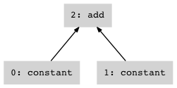
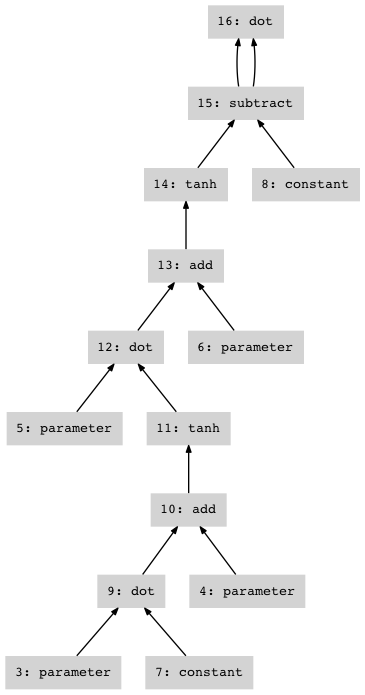

Python Easy Neural Network Extruder
===================================

This is a library that tries to make creating neural networks as easy as
possible by being as similar to Python/NumPy as possible. It borrows
heavily from `Theano <http://deeplearning.net/software/theano/>`__ and
`CNN <https://github.com/clab/cnn>`__. If you find it useful, or want to
help improve it, please let me (David Chiang) know!

The library is in pure Python and doesn't need to be built. Just make
sure that the ``penne`` package directory (the one containing
``__init__.py``) is in your Python path and import the package (note,
don't ``import * from`` both ``numpy`` and ``penne``, as they have many
symbols in common):

.. code:: python

    import numpy
    from penne import *

Expressions
-----------

A network is defined as a giant expression object that is built using
normal-looking operations, but isn't evaluated right away.

.. code:: python

    x = constant(2.)
    y = constant(2.)
    z = x + y
    z

``constant(value)`` creates an expression whose value is ``value``,
typically a NumPy array, and ``x + y`` creates a new expression that is
the sum of ``x`` and ``y``, but doesn't actually perform the addition
yet. That is the job of ``compute_values``, which takes an expression
and returns a dictionary mapping from all subexpressions to their
values.

.. code:: python

    values = compute_values(z)
    values[z]

.. parsed-literal::

    4.0

The following operators and NumPy-like operations work on expressions:

-  the ``[]`` operator for indexing or slicing
-  ``concatenate``, ``stack``, ``transpose``
-  ``+``, ``-``, ``*``, ``/`` (scalar or elementwise multiplication or
   division)
-  ``dot``, ``einsum``
-  ``log``, ``exp``
-  ``maximum``, ``minimum``, ``clip``
-  ``where``
-  ``asum`` is like ``numpy.sum``; ``amax``, ``amin``, ``mean``

Also, more specialized functions:

-  Activation functions ``sigmoid``, ``tanh``, ``hardtanh``,
   ``logsoftmax``, ``rectify``
-  Loss functions ``crossentropy``, ``distance2`` (squared Euclidean
   distance)
-  Module ``conv`` provides ``convolve`` and ``pool``, ``max_pool``,
   ``mean_pool``

Parameters
----------

As a slightly more complex example, suppose we want to define the
following network:

.. math::

   \begin{aligned}
   h &= \tanh (V i + a) \\
   o &= \tanh (W h + b) \\
   e &= \|o - c\|^2
   \end{aligned}

where :math:`i` is the input vector and :math:`c` is the correct output
vector. The parameters of the model are matrices :math:`V` and :math:`W`
and vectors :math:`a` and :math:`b`.

Parameters are created like constants, using ``parameter(value)``, where
``value`` is the initial value of the parameter.

.. code:: python

    nh = 3
    V = parameter(numpy.random.uniform(-1., 1., (nh, 2)))
    a = parameter(numpy.zeros((nh,)))
    W = parameter(numpy.random.uniform(-1., 1., (1, nh)))
    b = parameter(numpy.zeros((1,)))

The inputs and correct outputs are going to be "constants" whose value
we will change from example to example:

.. code:: python

    i = constant(numpy.empty((2,)))
    c = constant(numpy.empty((1,)))

Finally, define the network. This is nearly a straight copy of the
equations above:

.. code:: python

    h = tanh(dot(V, i) + a)
    o = tanh(dot(W, h) + b)
    e = distance2(o, c)
    e

Training
--------

To train the network, first create a trainer object
(``SGD``/``StochasticGradientDescent``, ``Adagrad``, ``Adadelta``,
``Momentum``, or ``Nesterov``). Then, feed it expressions using the
``receive`` method; the trainer will update the parameters to try to
minimize each expression.

.. code:: python

    import random
    trainer = SGD(learning_rate=0.1)
    data = [[-1., -1., -1.], 
            [-1.,  1.,  1.],
            [ 1., -1.,  1.],
            [ 1.,  1., -1.]] * 10
    for epoch in xrange(10):
        random.shuffle(data)
        loss = 0.
        for x, y, z in data:
            i.value[...] = [x, y]
            c.value[...] = [z]
            loss += trainer.receive(e)
        print(loss/len(data))

.. parsed-literal::

    1.26393291958
    0.891314734712
    0.188155285283
    0.0469943263666
    0.024600482034
    0.017526493249
    0.0127224090239
    0.010137842767
    0.00837241824957
    0.00708963491692

To save the model, call ``save_model(file)`` where ``file`` is a
file-like object. To load a model, you must build your expressions in
*exactly the same way* that you did up to the point that you saved the
model, then call ``load_model(file)``.

Debugging
---------

While it is often the case that a network works perfectly on the first
try, bugs do happen. Module ``logging`` has two flags that you can set
to help with debugging:

-  ``logging.debug`` adds information to expression objects so that if
   an error occurs when using an expression, you get, in addition to the
   usual traceback, a traceback of where the expression was created.
-  ``logging.trace`` causes ``compute_values`` and ``compute_gradients``
   to print out their computations step by step.

If you add your own expression operations, you can debug the automatic
differentiation using ``check_gradients``:

.. code:: python

    auto = compute_gradients(e)
    check = check_gradients(e)
    sum(numpy.linalg.norm(auto[x]-check[x])**2 for x in check)

.. parsed-literal::

    8.727630614846172e-14

More complex expressions
------------------------

Since expressions are just objects, you can put them inside lists,
dicts, etc., and you can also pass them to and return them from
functions. By taking advantage of this, you can define very complex
networks without very much clutter.

For example, the function ``make_layer`` simplifies definitions of
feedforward neural networks. It takes an input size and output size and
returns a function. This function, in turn, creates a fully-connected
layer :math:`y = f(Wx+b)`, including properly-initialized parameters
:math:`W` and :math:`b`. The same example above using ``make_layer``
would be:

.. code:: python

    h = make_layer(2, nh)(i)
    o = make_layer(nh, 1)(h)
    e = distance2(o, c)

The parameters of the two layers are there, but hidden from our view.
The reason for the two-step usage is to control parameter sharing. If
you call ``make_layer`` twice, you get two different layers with
different parameters. But if you call it once and use the result twice,
you get two layers with shared parameters.

A possible definition of ``make_layer`` would be:

.. code:: python

    def my_make_layer(ni, no):
        W = parameter(numpy.random.uniform(-1., 1., (no, ni)))
        b = parameter(numpy.zeros((no,)))
        def layer(i):
            return tanh(dot(W, i) + b)
        return layer

``my_make_layer`` creates a function closure that contains both the
inner function and the parameters ``W`` and ``b``. Or if you don't like
function closures, we can do the exact same thing using objects:

.. code:: python

    class my_make_layer(object):
        def __init__(self, ni, no):
            self.W = parameter(numpy.random.uniform(-1., 1., (no, ni)))
            self.b = parameter(numpy.zeros((no,)))
        def __call__(self, i):
            return tanh(dot(self.W, i) + self.b)

The real ``make_layer`` has some extra bells and whistles.

-  it can take a sequence of input sizes instead of a single input size
-  a negative input size gives you an input that takes an integer ``i``
   and selects the ``i``\ th row of weights
-  the ``bias`` option lets you specify the initial bias; ``None`` means
   no bias
-  the ``f`` option lets you set the activation function (default is
   ``tanh``)

Transducers
-----------

We can build unfolded recurrent networks using transducers, which are
extensions of class ``Transducer``. Their inputs and outputs are
sequences of expressions or other objects (e.g., words). A transducer
contains, not only parameters like layers do, but an expression
representing its internal *state*. A transducer should define two
methods:

-  ``start()`` resets the transducer's internal state to the initial
   state.
-  ``step(inp)`` reads in ``inp`` as an input and returns the output,
   updating the internal state.

The following convenience method is defined in terms of the above:

-  ``transduce(inps)`` reads in a sequence of inputs and returns a
   sequence of outputs.

Module ``recurrent`` defines three RNN classes:

-  ``Simple(nh, ni, no)`` is a simple RNN, with a tanh inside. Argument
   ``nh`` is the number of hidden units, ``ni`` the number of input
   units, and ``no`` the number of output units.
-  ``LSTM(nh, ni, no)`` is a long short term memory RNN, as defined in
   Graves, "Generating Sequences with RNNs." Arguments are the same as
   ``Simple``.
-  ``Stacked(r1, r2, ...)`` stacks the RNNs ``r1``, ``r2``, etc., into a
   deep RNN. Formally, this is the same as FST composition: the output
   sequence of ``r1`` is the input sequence of ``r2``, and so on.

.. code:: python

    from penne import recurrent
    nh = 100
    r = recurrent.LSTM(nh, -256, nh)
    output_layer = make_layer(nh, 256, f=logsoftmax)
    r.start()
    w = map(ord, "^the cat sat on the mat$")
    loss = constant(0.)
    for t in xrange(len(w)-1):
        h = r.step(w[t])
        o = output_layer(h)
        loss -= o[w[t+1]]

Normally, to train the model, you would build a new expression for each
string, but for this simple example, just train the model on the same
string over and over:

.. code:: python

    trainer = Adagrad(learning_rate=0.1)
    for i in xrange(100):
        trainer.receive(loss)

Obligatory randomly generated strings:

.. code:: python

    for i in xrange(10):
        c = ord('^')
        r.start()
        values = {}
        w = []
        for t in xrange(40):
            h = r.step(c)
            o = output_layer(h)
            values = compute_values(o, values)
            c = numpy.argmax(numpy.random.multinomial(1, numpy.exp(values[o])))
            if c == ord('$'): break
            w.append(chr(c))
        print ''.join(w)

.. parsed-literal::

    the cat sat on the mat
    the cat sat on the mat
    the cat sat on the mat
    the cat sat on the mat
    the cat sat on the mat
    the cat sat on the mat
    the cat sat on the mat
    the cat sat on the mat
    the cat sat on the mat
    the cat sat on the mat

The implementation of ``LSTM`` is not terribly complicated, and
illustrates how to implement transducers. The ``__init__`` method
creates all the parameters (indirectly, using ``make_layer``). The
``start`` method sets the initial states (an LSTM has two of them). The
``step`` method updates the states according to the LSTM definition.

.. code:: python

    class LSTM(recurrent.Transducer):
        def __init__(self, hidden_dims, input_dims, output_dims):
            dims = [input_dims, hidden_dims, hidden_dims]
            self.input_gate = make_layer(dims, hidden_dims, f=sigmoid)
            self.forget_gate = make_layer(dims, hidden_dims, f=sigmoid)
            self.output_gate = make_layer(dims, hidden_dims, f=sigmoid)
            self.input_layer = make_layer(dims[:-1], hidden_dims, f=tanh)
            self.h0 = constant(numpy.zeros((hidden_dims,)))
            self.c0 = constant(numpy.zeros((hidden_dims,)))
    
        def start(self):
            self.h = self.h0
            self.c = self.c0
    
        def step(self, inp):
            i = self.input_gate(inp, self.h, self.c)
            f = self.forget_gate(inp, self.h, self.c)
            self.c = f * self.c + i * self.input_layer(inp, self.h)
            o = self.output_gate(inp, self.h, self.c)
            self.h = o * tanh(self.c)
            return o
